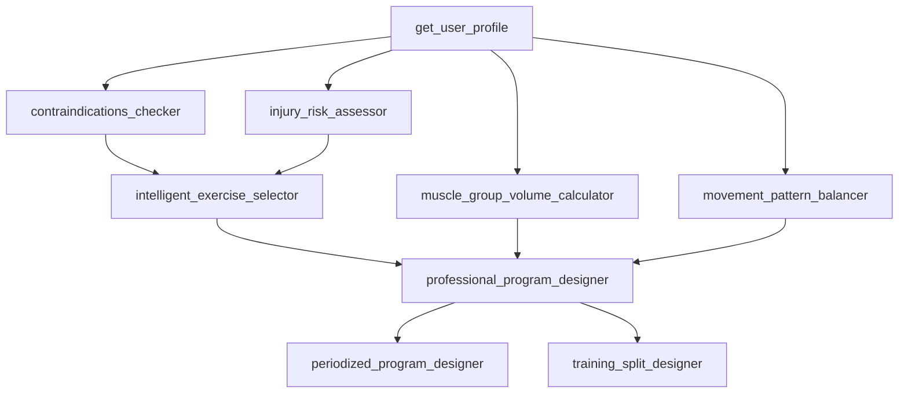
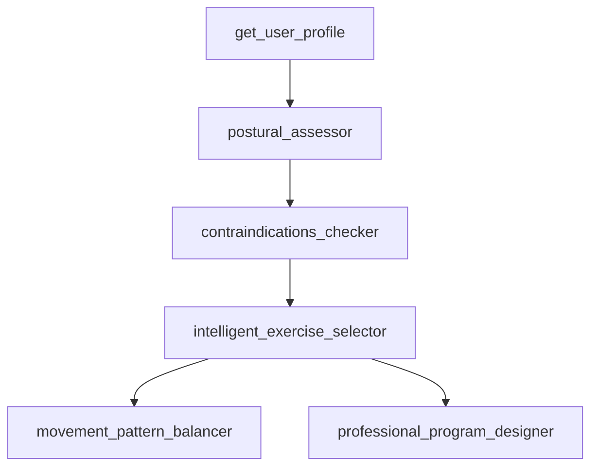

# DAG模板架构

**版本**: v2.0.0  
**创建日期**: 2025-12-22  
**更新日期**: 2026-01-06  
**状态**: ✅ 已完成

---

## 概述

DAG模板系统是DAML-RAG框架三段式架构（LLM决策 + 程序执行 + LLM综合）的核心组件，提供预定义的工作流程模板供LLM决策引擎选择。通过模板化的方式，确保LLM不直接调用MCP工具，避免幻觉和不可控行为。

**v1.1.0更新**：新增posture_correction（体态矫正）模板，支持12种体态问题的评估和矫正训练计划制定。

**v2.0.0更新**：
- 新增plan_adjustment（训练计划调整）模板
- 新增fat_loss_program（减脂专项）模板
- 新增strength_program（力量专项）模板
- 模板总数从10个扩展至13个
- 新增条件分支执行器和DAG重试处理器支持

### 设计理念

**核心思想**：LLM做决策，程序做执行

- ✅ **LLM的职责**：理解用户意图，从模板库中选择最合适的DAG方案
- ✅ **程序的职责**：严格按照选定的DAG模板执行工具链，保证依赖关系和数据安全
- ❌ **避免的问题**：LLM直接调用MCP工具导致的幻觉、虚假数据、不可控行为

### 架构优势

1. **可预测性**：所有工作流程都是预定义的，执行路径清晰可控
2. **安全性**：LLM无法直接操作工具，避免安全风险
3. **可维护性**：模板集中管理，易于更新和扩展
4. **可追溯性**：每次执行都有明确的模板ID和选择理由
5. **性能优化**：模板预定义了依赖关系和并行策略，执行效率高

---

## 模板分类体系

### 按类别分类

```
TemplateCategory (5个类别)
├─ TRAINING (训练相关)
│   ├─ complete_training_plan - 完整训练计划
│   ├─ exercise_optimization - 动作优化
│   ├─ progress_analysis - 进展分析
│   ├─ plan_adjustment - 训练计划调整 ✨ v2.0.0新增
│   ├─ fat_loss_program - 减脂专项 ✨ v2.0.0新增
│   └─ strength_program - 力量专项 ✨ v2.0.0新增
│
├─ NUTRITION (营养相关)
│   └─ nutrition_planning - 营养规划
│
├─ SAFETY (安全评估)
│   ├─ safety_assessment - 安全评估
│   ├─ rehabilitation_training - 康复训练
│   └─ posture_correction - 体态矫正 ✨ v8.47.0新增
│
├─ COMPREHENSIVE (综合方案)
│   └─ comprehensive_fitness - 综合健身方案
│
└─ QUICK (快速咨询)
    ├─ greeting - 问候闲聊
    └─ quick_consultation - 快速咨询
```

### 按复杂度分类

```
复杂度等级 (1-3)
├─ 简单 (Level 1)
│   ├─ greeting - 问候闲聊 (1秒)
│   ├─ quick_consultation - 快速咨询 (2秒)
│   └─ exercise_optimization - 动作优化 (6秒)
│
├─ 中等 (Level 2)
│   ├─ safety_assessment - 安全评估 (8秒)
│   ├─ progress_analysis - 进展分析 (8秒)
│   ├─ nutrition_planning - 营养规划 (10秒)
│   ├─ posture_correction - 体态矫正 (10秒) ✨ v8.47.0新增
│   └─ plan_adjustment - 训练计划调整 (8秒) ✨ v2.0.0新增
│
└─ 复杂 (Level 3)
    ├─ rehabilitation_training - 康复训练 (12秒)
    ├─ complete_training_plan - 完整训练计划 (15秒)
    ├─ comprehensive_fitness - 综合健身方案 (20秒)
    ├─ fat_loss_program - 减脂专项 (15秒) ✨ v2.0.0新增
    └─ strength_program - 力量专项 (12秒) ✨ v2.0.0新增
```

---

## 10个核心模板详解

> **注意**: v2.0.0版本已扩展至13个模板，新增3个专项模板（plan_adjustment、fat_loss_program、strength_program）

### 1. 问候闲聊 (greeting)

**模板ID**: `greeting`  
**类别**: QUICK  
**复杂度**: ⭐ (1秒)

**适用场景**：
- 用户打招呼、问候
- 简单闲聊，不涉及具体健身问题

**关键词**：你好、早上好、晚上好、hi、hello、嗨、在吗

**工具链**：
```
无需调用任何工具
```

**响应策略**：简短友好，1-2句话，不提供训练建议

---

### 2. 完整训练计划 (complete_training_plan)

**模板ID**: `complete_training_plan`  
**类别**: COMPREHENSIVE  
**复杂度**: ⭐⭐⭐ (15秒)

**适用场景**：
- 制定系统的、详细的训练方案
- 包含动作选择、训练量计算、周期化安排
- 用户明确要求"完整"、"详细"、"系统"的计划

**关键词**：完整、详细、系统、全面、4周、8周、12周、训练计划、增肌计划、力量计划

**工具链**：
```
必需工具 (6个):
1. get_user_profile - 获取用户档案
2. contraindications_checker - 禁忌症检查
3. injury_risk_assessor - 损伤风险评估
4. intelligent_exercise_selector - 智能动作选择
5. muscle_group_volume_calculator - 训练量计算
6. professional_program_designer - 专业计划设计

可选工具 (3个):
7. movement_pattern_balancer - 动作模式平衡
8. periodized_program_designer - 周期化设计
9. training_split_designer - 训练分化设计
```

**依赖关系**：


**并行执行策略**：
```
Level 0: [get_user_profile]
Level 1: [contraindications_checker, injury_risk_assessor, 
          muscle_group_volume_calculator, movement_pattern_balancer] (并行)
Level 2: [intelligent_exercise_selector]
Level 3: [professional_program_designer]
Level 4: [periodized_program_designer, training_split_designer] (并行)
```

**安全约束**：
- 必须执行contraindications_checker
- 必须执行injury_risk_assessor
- 禁忌动作必须从推荐中排除

**响应策略**：详细专业，提供完整的训练计划，包含动作选择、组数次数、训练量分配、周期化安排，字数300-500字

---

### 3. 营养规划 (nutrition_planning)

**模板ID**: `nutrition_planning`  
**类别**: NUTRITION  
**复杂度**: ⭐⭐ (10秒)

**适用场景**：
- 制定营养方案、膳食计划
- 关注饮食、营养摄入

**关键词**：营养、饮食、吃什么、膳食、食物、热量、蛋白质、碳水

**工具链**：
```
必需工具 (4个):
1. get_user_profile - 获取用户档案
2. tdee_calculator - TDEE计算
3. nutrition_intake_analyzer - 营养摄入分析
4. meal_plan_designer - 膳食计划设计

可选工具 (1个):
5. exercise_nutrition_optimization - 运动营养优化
```

**依赖关系**：
```
get_user_profile → tdee_calculator → nutrition_intake_analyzer → meal_plan_designer
                                                                 ↓
                                                    exercise_nutrition_optimization
```

**响应策略**：专业详细，提供完整的营养方案，包含TDEE计算、宏量营养素分配、膳食计划建议，字数200-400字

---

### 4. 安全评估 (safety_assessment)

**模板ID**: `safety_assessment`  
**类别**: SAFETY  
**复杂度**: ⭐⭐ (8秒)

**适用场景**：
- 评估运动安全性
- 识别风险和禁忌

**关键词**：安全、禁忌、风险、能否、可以做、不能做、危险

**工具链**：
```
必需工具 (3个):
1. get_user_profile - 获取用户档案
2. contraindications_checker - 禁忌症检查
3. injury_risk_assessor - 损伤风险评估

可选工具 (2个):
4. safe_exercise_modifier - 安全动作调整
5. exercise_alternative_finder - 替代动作查找
```

**并行执行策略**：
```
Level 0: [get_user_profile]
Level 1: [contraindications_checker, injury_risk_assessor] (并行)
Level 2: [safe_exercise_modifier, exercise_alternative_finder] (并行)
```

**响应策略**：专业严谨，重点说明安全风险和禁忌事项，提供具体的安全建议和替代方案，字数150-300字

---

### 5. 动作优化 (exercise_optimization)

**模板ID**: `exercise_optimization`  
**类别**: TRAINING  
**复杂度**: ⭐ (6秒)

**适用场景**：
- 动作推荐、替代方案
- 动作调整和优化

**关键词**：动作、替代、换、推荐、选择、哪些动作

**工具链**：
```
必需工具 (3个):
1. get_user_profile - 获取用户档案
2. intelligent_exercise_selector - 智能动作选择
3. exercise_alternative_finder - 替代动作查找

可选工具 (4个):
4. contraindications_checker - 禁忌症检查
5. safe_exercise_modifier - 安全动作调整
6. movement_pattern_balancer - 动作模式平衡
7. intelligent_weight_calculator - 智能重量计算
```

**响应策略**：简洁实用，重点推荐2-3个动作，说明选择理由和执行要点，提供替代方案，字数100-200字

---

### 6. 综合健身方案 (comprehensive_fitness)

**模板ID**: `comprehensive_fitness`  
**类别**: COMPREHENSIVE  
**复杂度**: ⭐⭐⭐ (20秒)

**适用场景**：
- 需要训练+营养的完整解决方案
- 系统性的健身指导

**关键词**：综合、全面、完整方案、系统方案、训练和营养

**工具链**：
```
必需工具 (8个):
1. get_user_profile
2. contraindications_checker
3. injury_risk_assessor
4. intelligent_exercise_selector
5. muscle_group_volume_calculator
6. professional_program_designer
7. tdee_calculator
8. meal_plan_designer

可选工具 (3个):
9. periodized_program_designer
10. training_split_designer
11. exercise_nutrition_optimization
```

**并行执行策略**：
```
Level 0: [get_user_profile]
Level 1: [contraindications_checker, injury_risk_assessor, 
          muscle_group_volume_calculator, tdee_calculator] (并行)
Level 2: [intelligent_exercise_selector]
Level 3: [professional_program_designer]
Level 4: [meal_plan_designer, periodized_program_designer, 
          training_split_designer] (并行)
Level 5: [exercise_nutrition_optimization]
```

**响应策略**：全面系统，提供训练和营养的完整方案，包含安全评估、训练计划、营养计划、周期化安排，字数500-800字

---

### 7. 快速咨询 (quick_consultation)

**模板ID**: `quick_consultation`  
**类别**: QUICK  
**复杂度**: ⭐ (2秒)

**适用场景**：
- 简单的、一般性的健身问题
- 不需要复杂的工具链

**关键词**：简单问题、快速咨询、基础问题、一般咨询

**工具链**：
```
必需工具 (1个):
1. get_user_profile - 获取用户档案
```

**重要约束**：
- ⚠️ 如果用户明确要求"完整"、"详细"、"系统"的计划，绝对不要选择此模板
- ⚠️ 仅当查询非常简单且不涉及具体计划时选择

**响应策略**：简洁明了，直接回答用户问题，提供实用建议，2-3段话，字数100-200字

---

### 8. 进展分析 (progress_analysis)

**模板ID**: `progress_analysis`  
**类别**: TRAINING  
**复杂度**: ⭐⭐ (8秒)

**适用场景**：
- 分析训练进展
- 数据分析和效果评估

**关键词**：进展、分析、效果、数据、进度、评估

**工具链**：
```
必需工具 (2个):
1. get_user_profile - 获取用户档案
2. muscle_group_volume_calculator - 训练量计算

可选工具 (1个):
3. periodized_program_designer - 周期化设计
```

**响应策略**：数据驱动，分析训练进展和效果，指出优化方向，提供具体的改进建议，字数200-300字

---

### 9. 康复训练 (rehabilitation_training)

**模板ID**: `rehabilitation_training`  
**类别**: SAFETY  
**复杂度**: ⭐⭐⭐ (12秒)

**适用场景**：
- 有伤病史的用户
- 需要安全的康复训练方案

**关键词**：康复、伤后、恢复、受伤、伤病

**工具链**：
```
必需工具 (4个):
1. get_user_profile
2. contraindications_checker
3. injury_risk_assessor
4. safe_exercise_modifier

可选工具 (3个):
5. exercise_alternative_finder
6. intelligent_exercise_selector
7. movement_pattern_balancer
```

**并行执行策略**：
```
Level 0: [get_user_profile]
Level 1: [contraindications_checker, injury_risk_assessor] (并行)
Level 2: [safe_exercise_modifier]
Level 3: [exercise_alternative_finder, intelligent_exercise_selector] (并行)
Level 4: [movement_pattern_balancer]
```

**安全约束**：
- 必须严格安全评估
- 必须避免加重伤病
- 必须循序渐进
- 必须持续监控

**响应策略**：谨慎专业，重点强调安全性和循序渐进，提供详细的康复训练计划和注意事项，字数300-400字

---

### 10. 体态矫正 (posture_correction) ✨ v8.47.0新增

**模板ID**: `posture_correction`  
**类别**: SAFETY  
**复杂度**: ⭐⭐ (10秒)

**适用场景**：
- 用户有体态问题（骨盆前倾、圆肩、驼背等）
- 需要体态评估和矫正训练方案
- 关注姿势改善和体态矫正

**关键词**：体态、姿势、圆肩、驼背、骨盆前倾、体态矫正、改善体态、矫正训练

**工具链**：
```
必需工具 (4个):
1. get_user_profile - 获取用户档案
2. postural_assessor - 体态评估
3. contraindications_checker - 禁忌症检查
4. intelligent_exercise_selector - 智能动作选择

可选工具 (2个):
5. movement_pattern_balancer - 动作模式平衡
6. professional_program_designer - 专业计划设计
```

**依赖关系**：


**并行执行策略**：
```
Level 0: [get_user_profile]
Level 1: [postural_assessor]
Level 2: [contraindications_checker]
Level 3: [intelligent_exercise_selector]
Level 4: [movement_pattern_balancer, professional_program_designer] (并行)
```

**安全约束**：
- 必须识别体态问题
- 必须推荐矫正动作
- 必须警告加重动作
- 必须循序渐进矫正

**预期输出**：
```json
{
  "user_profile": "用户档案",
  "postural_assessment": "体态评估结果",
  "corrective_exercises": "矫正动作列表",
  "aggravating_exercises": "加重动作警告",
  "correction_plan": "矫正训练计划"
}
```

**响应策略**：专业友好，重点说明体态问题的成因和影响，提供系统的矫正训练计划和日常注意事项，字数300-400字

---

## 模板数据结构

### DAGTemplate 核心字段

```python
@dataclass
class DAGTemplate:
    """DAG模板定义"""
    template_id: str                              # 模板唯一标识
    name: str                                     # 模板名称
    description: str                              # 模板描述
    category: TemplateCategory                    # 模板类别
    applicable_intents: List[str]                 # 适用意图列表
    required_tools: List[str]                     # 必需工具列表
    optional_tools: List[str]                     # 可选工具列表
    tool_dependencies: Dict[str, List[str]]       # 工具依赖关系
    parallel_groups: List[List[str]]              # 并行执行组
    expected_output: Dict[str, str]               # 预期输出
    safety_constraints: List[str]                 # 安全约束
    estimated_duration_seconds: float             # 预估耗时
    complexity_level: int                         # 复杂度等级 (1-3)
    success_rate: float                           # 成功率
    response_hint: str                            # LLM响应提示
```

### 模板验证规则

```python
def validate(self) -> bool:
    """验证模板完整性"""
    # 1. 检查必需字段
    if not self.template_id or not self.name:
        return False
    
    # 2. 检查工具列表（greeting模板允许为空）
    if not self.required_tools and self.template_id != "greeting":
        return False
    
    # 3. 检查依赖关系中的工具是否在工具列表中
    all_tools = set(self.required_tools + self.optional_tools)
    for tool, deps in self.tool_dependencies.items():
        if tool not in all_tools:
            return False
        for dep in deps:
            if dep not in all_tools:
                return False
    
    # 4. 检查并行组中的工具是否在工具列表中
    for group in self.parallel_groups:
        for tool in group:
            if tool not in all_tools:
                return False
    
    return True
```

---

## 模板选择机制

### LLM决策流程

```
用户查询 → LLM决策引擎 → 模板选择 → DAG编排器执行
```

**步骤1：构建选择提示词**
- 提取用户档案关键信息
- 格式化所有可用模板
- 提供详细的选择指南

**步骤2：LLM分析**
- 理解用户意图
- 匹配关键词
- 评估置信度

**步骤3：返回选择结果**
```json
{
  "selected_template_id": "complete_training_plan",
  "selection_reason": "用户要求制定完整的增肌训练计划",
  "expected_tools": ["get_user_profile", "contraindications_checker", ...],
  "confidence": 0.95,
  "alternative_templates": ["comprehensive_fitness"],
  "matched_keywords": ["完整", "训练计划", "增肌"]
}
```

### 关键词权重规则

```
高权重关键词 (权重×2):
- 完整、详细、系统、全面
- 4周、8周、12周、X周

中权重关键词 (权重×1.5):
- 制定、设计、帮我、给我、想要

模板特定关键词 (权重×1):
- 各模板定义中的关键词
```

### 降级策略

当LLM调用失败或选择无效时，使用基于规则的降级策略：

```python
# 规则1: 关键词匹配（按优先级排序）
keyword_mapping = {
    "complete_training_plan": ["完整", "详细", "系统", "4周", "8周", "12周"],
    "nutrition_planning": ["营养", "饮食", "膳食", "吃什么"],
    "safety_assessment": ["安全", "禁忌", "风险", "能否"],
    "exercise_optimization": ["动作", "替代", "换", "推荐动作"],
    ...
}

# 规则2: 默认选择（快速咨询）
if no_match:
    return "quick_consultation"
```

---

## 模板扩展机制

### 添加新模板的步骤

**步骤1：定义模板**
```python
self.templates["new_template"] = DAGTemplate(
    template_id="new_template",
    name="新模板名称",
    description="模板描述",
    category=TemplateCategory.TRAINING,
    applicable_intents=["关键词1", "关键词2"],
    required_tools=["tool1", "tool2"],
    optional_tools=["tool3"],
    tool_dependencies={
        "tool1": [],
        "tool2": ["tool1"],
        "tool3": ["tool2"]
    },
    parallel_groups=[
        ["tool1"],
        ["tool2", "tool3"]
    ],
    expected_output={
        "key1": "描述1",
        "key2": "描述2"
    },
    safety_constraints=["约束1", "约束2"],
    estimated_duration_seconds=10.0,
    complexity_level=2,
    success_rate=0.90,
    response_hint="响应提示"
)
```

**步骤2：更新LLM提示词**
- 在`llm_decision_engine.py`的`_build_selection_prompt`方法中添加新模板的选择指南
- 包含定义、关键词、示例查询、置信度要求

**步骤3：更新降级策略**
- 在`llm_decision_engine.py`的`_fallback_selection`方法中添加关键词映射

**步骤4：验证模板**
```python
# 自动验证
manager = DAGTemplateManager()
# 所有模板会在初始化时自动验证
```

### 模板版本管理

```python
# 导出模板到JSON
manager.export_templates("templates_v1.0.json")

# 模板统计
stats = manager.get_template_statistics()
# {
#     "total_templates": 9,
#     "by_category": {"training": 3, "nutrition": 1, ...},
#     "by_complexity": {1: 3, 2: 3, 3: 3},
#     "average_duration": 9.2,
#     "total_tools": 16
# }
```

---

## 性能优化策略

### 1. 并行执行优化

**策略**：利用模板预定义的`parallel_groups`实现任务并行

```python
# 模板定义的并行组
parallel_groups = [
    ["get_user_profile"],
    ["contraindications_checker", "injury_risk_assessor", 
     "muscle_group_volume_calculator"],  # 这3个可以并行
    ["intelligent_exercise_selector"],
    ["professional_program_designer"]
]

# 编排器自动并行执行
for group in parallel_groups:
    results = await asyncio.gather(*[execute_tool(tool) for tool in group])
```

**优势**：
- 减少总执行时间
- 充分利用系统资源
- 保证依赖关系正确

### 2. 可选工具智能选择

**策略**：根据模板复杂度和用户档案动态选择可选工具

```python
def _select_optional_tools_from_template(template, user_profile):
    if template.complexity_level == 3:
        # 复杂模板：选择所有可选工具
        return template.optional_tools
    elif template.complexity_level == 2:
        # 中等模板：选择前一半可选工具
        return template.optional_tools[:len(template.optional_tools)//2 + 1]
    else:
        # 简单模板：选择1-2个可选工具
        return template.optional_tools[:2]
```

**优势**：
- 平衡功能完整性和执行效率
- 根据用户需求动态调整
- 避免不必要的工具调用

### 3. 缓存策略

**策略**：缓存可重复使用的工具结果

```python
# 工具元数据定义缓存策略
ToolMetadata(
    name="get_user_profile",
    cacheable=True,
    cache_ttl=3600,  # 1小时
    ...
)

# 执行时自动检查缓存
cached_result = await cache_manager.get_cache(cache_key)
if cached_result:
    return cached_result
```

**优势**：
- 减少重复计算
- 提升响应速度
- 降低系统负载

---

## 监控和统计

### 模板使用统计

```python
performance_stats = {
    "total_executions": 1000,
    "successful_executions": 950,
    "failed_executions": 50,
    "average_execution_time": 8.5,
    "template_usage": {
        "complete_training_plan": 350,
        "nutrition_planning": 200,
        "exercise_optimization": 180,
        "quick_consultation": 150,
        ...
    }
}
```

### 模板性能指标

```python
# 每个模板的性能指标
template_metrics = {
    "complete_training_plan": {
        "total_calls": 350,
        "success_rate": 0.96,
        "average_duration": 14.2,
        "p95_duration": 18.5,
        "p99_duration": 22.1
    },
    ...
}
```

### 选择质量监控

```python
selection_stats = {
    "total_selections": 1000,
    "successful_selections": 920,
    "fallback_selections": 80,
    "average_confidence": 0.82,
    "success_rate": 0.92,
    "fallback_rate": 0.08
}
```

---

## 最佳实践

### 1. 模板设计原则

✅ **单一职责**：每个模板专注于一个明确的场景  
✅ **依赖清晰**：明确定义工具间的依赖关系  
✅ **并行优化**：合理设计并行执行组  
✅ **安全优先**：关键安全工具必须执行  
✅ **响应提示**：为LLM提供明确的响应指导

### 2. 关键词设计原则

✅ **覆盖全面**：包含用户可能使用的各种表达  
✅ **权重合理**：高权重关键词应该是强意图信号  
✅ **避免冲突**：不同模板的关键词应该有明确区分  
✅ **持续优化**：根据实际使用情况调整关键词

### 3. 性能优化原则

✅ **并行优先**：尽可能利用并行执行  
✅ **缓存优先**：缓存可重复使用的结果  
✅ **按需加载**：可选工具根据需求动态选择  
✅ **超时控制**：设置合理的超时时间  
✅ **降级策略**：提供可靠的降级方案

### 4. 监控和维护

✅ **使用统计**：定期分析模板使用情况  
✅ **性能监控**：监控每个模板的执行性能  
✅ **质量评估**：评估LLM选择的准确性  
✅ **用户反馈**：收集用户对结果的反馈  
✅ **持续迭代**：根据数据优化模板设计

---

## 相关文档

- **三段式编排器架构**: `01-三段式编排器架构.md`
- **MCP工具架构**: `03-MCP工具架构.md`
- **LLM决策引擎**: `../04-LLM层/01-智能模型选择架构.md`
- **DAG模板代码实现**: `../../03-代码参考/04-DAG模板实现/02-DAG模板代码实现.md`
- **DAG模板开发指南**: `../../04-开发指南/01-快速上手/01-DAG模板开发指南.md`

---

**维护者**: 薛小川  
**最后更新**: 2025-12-22
