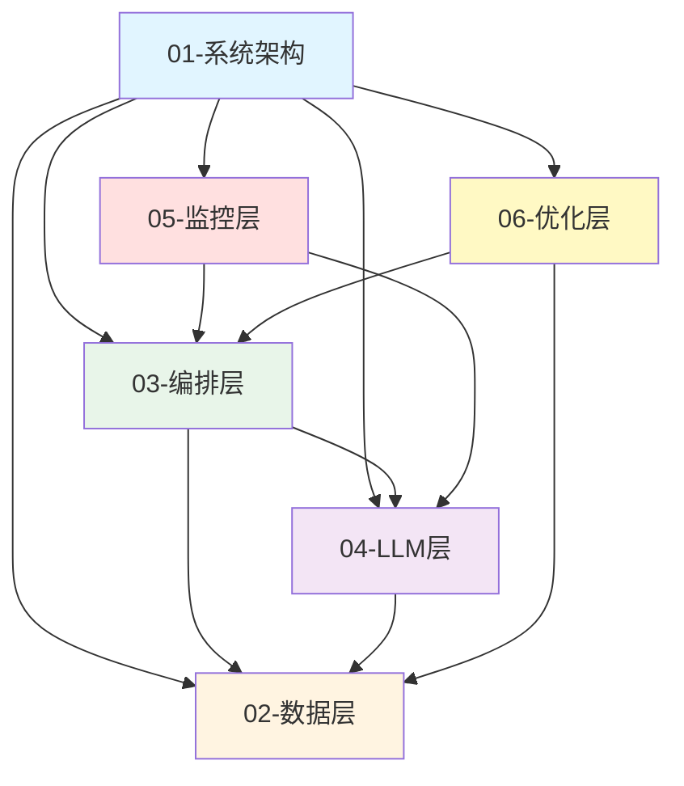

# 02-核心架构

**版本**: v8.1.0
**更新日期**: 2025-12-31
**状态**: ✅ v6.0架构同步完成

---

## 📋 概述

本目录包含DAML-RAG系统的核心架构设计文档，回答"是什么"和"为什么"的问题。文档按功能模块组织，涵盖系统架构、数据层、编排层、LLM层、监控层和优化层六大模块。

### 架构规模

- **代码文件**：172个Python文件（四层架构）
- **MCP工具**：18个（17个Python内置 + 1个stdio用户档案）
- **服务层**：16个业务逻辑组件
- **参数系统**：6个参数处理组件

---

## 📁 模块结构

### [01-系统架构](./01-系统架构/) - 系统整体设计

系统架构总览、工作流程、技术栈选型、框架层与应用层架构和代码目录结构。

**文档列表**：
- [01-系统架构总览.md](./01-系统架构/01-系统架构总览.md) - DAML-RAG系统整体架构设计
- [02-完整工作流程.md](./01-系统架构/02-完整工作流程.md) - 11步完整工作流程（三段式架构）
- [03-技术栈选型.md](./01-系统架构/03-技术栈选型.md) - 核心技术选型说明
- [04-框架层与应用层架构.md](./01-系统架构/04-框架层与应用层架构.md) - 框架层与应用层分离架构
- [05-代码目录结构.md](./01-系统架构/05-代码目录结构.md) - v6.0代码架构（172文件）

### [02-数据层](./02-数据层/) - 数据存储架构

Neo4j图数据库、Qdrant向量库、MySQL关系数据库和用户档案MCP数据结构。

**文档列表**：
- [01-数据库结构总览.md](./02-数据层/01-数据库结构总览.md) - Neo4j + Qdrant + MySQL + Redis整体结构
- [02-Neo4j数据库结构.md](./02-数据层/02-Neo4j数据库结构.md) - Neo4j图数据库详细分析（3,656节点，46,882关系）
- [03-Qdrant向量库结构.md](./02-数据层/03-Qdrant向量库结构.md) - Qdrant向量库结构（3,490向量，1024维BGE-M3）
- [04-MySQL数据结构.md](./02-数据层/04-MySQL数据结构.md) - MySQL关系数据库结构
- [05-用户档案MCP数据结构.md](./02-数据层/05-用户档案MCP数据结构.md) - 用户档案MCP服务数据结构

### [03-编排层](./03-编排层/) - 工作流编排架构

三段式编排器、DAG模板系统和MCP工具架构。

**文档列表**：
- [01-三段式编排器架构.md](./03-编排层/01-三段式编排器架构.md) - LLM决策 + 程序执行 + LLM综合
- [02-DAG模板架构.md](./03-编排层/02-DAG模板架构.md) - DAG模板分类、使用场景和扩展机制
- [03-MCP工具架构.md](./03-编排层/03-MCP工具架构.md) - 混合MCP架构（17个Python内置 + 1个stdio）
- [04-MCP架构演进历史.md](./03-编排层/04-MCP架构演进历史.md) - MCP架构演进详细历史

### [04-LLM层](./04-LLM层/) - LLM决策与分析

智能模型选择、Few-Shot检索、LLM模板和响应优化。

**文档列表**：
- [03-LLM模板架构.md](./04-LLM层/03-LLM模板架构.md) - LLM决策模板和分析模板设计

### [05-监控层](./05-监控层/) - 监控与可观测性

监控系统、流式输出、日志系统和告警系统架构。

**文档列表**：
- [01-监控系统架构.md](./05-监控层/01-监控系统架构.md) - Prometheus监控架构和性能监控指标
- [02-流式输出架构.md](./05-监控层/02-流式输出架构.md) - SSE实现和流式监控指标
- [03-日志系统架构.md](./05-监控层/03-日志系统架构.md) - 日志级别、格式规范和存储策略
- [04-告警系统架构.md](./05-监控层/04-告警系统架构.md) - 告警规则、分级机制和通知渠道

### [06-优化层](./06-优化层/) - 性能优化架构

缓存系统、连接池管理、并发限流和性能优化策略。

**文档列表**：
- [01-性能优化架构.md](./06-优化层/01-性能优化架构.md) - 缓存系统、连接池管理和并发限流架构

---

## 🔗 模块间关系图

**关系说明**：
- **系统架构**是基础，定义整体设计理念
- **数据层**为编排层和LLM层提供数据支持
- **编排层**协调LLM层和数据层的交互
- **LLM层**依赖数据层进行检索和分析
- **监控层**监控编排层和LLM层的运行状态
- **优化层**优化数据层和编排层的性能

---

## 📚 其他文档

本目录还包含一些未分类的架构文档：

- [22-接口设计规范.md](./22-接口设计规范.md) - 框架接口设计规范
- <!-- [24-代码目录结构.md](./24-代码目录结构.md) (文档不存在) --> - 代码组织结构说明
- [31-框架层代码文件说明.md](./31-框架层代码文件说明.md) - Framework层所有文件功能
- [32-应用层代码文件说明.md](./32-应用层代码文件说明.md) - Applications层所有文件功能

---

## 🚀 快速导航

### 新手入门路径
1. 阅读 [01-系统架构/01-系统架构总览.md](./01-系统架构/01-系统架构总览.md) 了解整体架构
2. 阅读 [01-系统架构/05-代码目录结构.md](./01-系统架构/05-代码目录结构.md) 了解代码架构（v6.0）
3. 阅读 [01-系统架构/02-完整工作流程.md](./01-系统架构/02-完整工作流程.md) 理解11步工作流程
4. 阅读 [02-数据层/01-数据库结构总览.md](./02-数据层/01-数据库结构总览.md) 了解数据存储
5. 阅读 [03-编排层/01-三段式编排器架构.md](./03-编排层/01-三段式编排器架构.md) 理解编排逻辑

### 深入学习路径
1. **数据层深入**：阅读02-数据层的所有文档，理解Neo4j、Qdrant和MySQL的详细结构
2. **编排层深入**：阅读03-编排层的所有文档，理解DAG模板和MCP工具的设计
3. **LLM层深入**：阅读04-LLM层的文档，理解LLM决策和分析模板
4. **监控层深入**：阅读05-监控层的所有文档，理解监控、日志和告警系统
5. **优化层深入**：阅读06-优化层的文档，理解性能优化策略

### 按主题查找
- **工作流程**：01-系统架构/02-完整工作流程.md
- **数据库**：02-数据层/所有文档
- **MCP工具**：03-编排层/03-MCP工具架构.md
- **DAG模板**：03-编排层/02-DAG模板架构.md
- **监控告警**：05-监控层/所有文档
- **性能优化**：06-优化层/01-性能优化架构.md

---

## 🔗 相关文档

- [03-代码参考](../03-代码参考/README.md) - 详细代码实现（How-实现）
- [04-开发指南](../04-开发指南/README.md) - 使用指南和最佳实践（How-使用）
- [05-API文档](../05-API文档/README.md) - MCP工具API参考

---

**维护者**: 薛小川
**最后更新**: 2025-12-31
