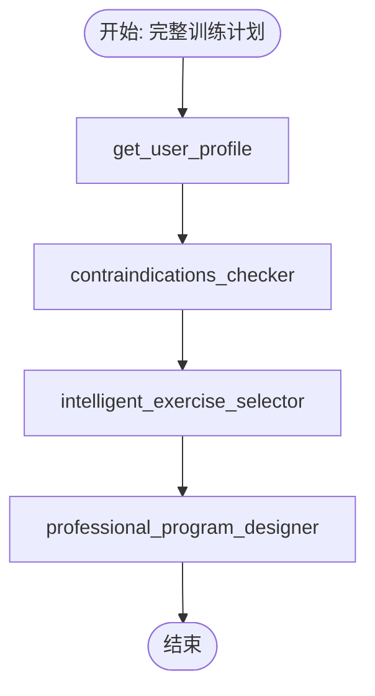

# DAG可视化和调试系统参考

**创建日期**: 2025-12-22

---


**版本**: v1.0.0  
**更新日期**: 2025-12-12  
**状态**: ✅ 生产就绪

---

## 概述

DAG可视化和调试系统提供了完整的工作流程可视化、执行日志输出和调试模式支持，帮助开发者理解执行过程和排查问题。

### 核心功能

1. **DAG结构可视化**
   - ASCII艺术图
   - Mermaid流程图
   - JSON结构
   - 树形结构

2. **执行日志输出**
   - 详细的工具执行信息
   - 时间戳和执行时长
   - 错误堆栈和上下文
   - 可配置的日志级别

3. **调试模式**
   - 中间结果输出
   - 决策过程记录
   - 详细参数和返回值
   - 性能分析

4. **执行历史查询**
   - 日志过滤和搜索
   - 执行摘要生成
   - 日志导出功能

---

## 架构设计

### 组件关系

```
┌─────────────────────────────────────────────────────────────┐
│                    DAGVisualizer                             │
│  ┌──────────────────────────────────────────────────────┐  │
│  │  可视化引擎                                           │  │
│  │  - ASCII生成器                                        │  │
│  │  - Mermaid生成器                                      │  │
│  │  - JSON生成器                                         │  │
│  │  - Tree生成器                                         │  │
│  └──────────────────────────────────────────────────────┘  │
│  ┌──────────────────────────────────────────────────────┐  │
│  │  日志系统                                             │  │
│  │  - 执行日志记录                                       │  │
│  │  - 日志级别控制                                       │  │
│  │  - 日志过滤和查询                                     │  │
│  │  - 日志导出                                           │  │
│  └──────────────────────────────────────────────────────┘  │
│  ┌──────────────────────────────────────────────────────┐  │
│  │  调试系统                                             │  │
│  │  - 决策过程记录                                       │  │
│  │  - 中间结果输出                                       │  │
│  │  - 性能分析                                           │  │
│  └──────────────────────────────────────────────────────┘  │
└─────────────────────────────────────────────────────────────┘
                     ↓
┌─────────────────────────────────────────────────────────────┐
│              集成到编排器                                     │
│  ┌──────────────────────────────────────────────────────┐  │
│  │  ThreeStageOrchestrator                              │  │
│  │  - 阶段1: LLM决策可视化                              │  │
│  │  - 阶段2: DAG执行可视化                              │  │
│  │  - 阶段3: LLM分析可视化                              │  │
│  └──────────────────────────────────────────────────────┘  │
│  ┌──────────────────────────────────────────────────────┐  │
│  │  EnhancedDAGOrchestrator                             │  │
│  │  - 工具执行日志                                       │  │
│  │  - 错误追踪                                           │  │
│  │  - 性能监控                                           │  │
│  └──────────────────────────────────────────────────────┘  │
└─────────────────────────────────────────────────────────────┘
```

---

## 核心类和方法

### 1. DAGVisualizer

**职责**: 提供DAG可视化和调试功能

#### 初始化

```python
from src.applications.fitness.dag_visualizer import (
    DAGVisualizer,
    VisualizationFormat,
    LogLevel
)

# 创建可视化器
visualizer = DAGVisualizer(
    debug_mode=True,           # 启用调试模式
    log_level=LogLevel.DEBUG   # 设置日志级别
)
```

#### 可视化格式

```python
class VisualizationFormat(Enum):
    """可视化格式"""
    ASCII = "ascii"           # ASCII艺术图
    MERMAID = "mermaid"       # Mermaid流程图
    JSON = "json"             # JSON结构
    TREE = "tree"             # 树形结构
```

#### 日志级别

```python
class LogLevel(Enum):
    """日志级别"""
    MINIMAL = 1      # 最小日志（仅关键信息）
    NORMAL = 2       # 正常日志（标准执行信息）
    DETAILED = 3     # 详细日志（包含参数和结果）
    DEBUG = 4        # 调试日志（所有中间结果和决策过程）
```

---

## 使用示例

### 1. DAG结构可视化

#### ASCII格式

```python
result = visualizer.visualize_dag_structure(
    template_name="完整训练计划",
    tools=[
        "get_user_profile",
        "contraindications_checker",
        "intelligent_exercise_selector",
        "professional_program_designer"
    ],
    dependencies={
        "get_user_profile": [],
        "contraindications_checker": ["get_user_profile"],
        "intelligent_exercise_selector": ["contraindications_checker"],
        "professional_program_designer": ["intelligent_exercise_selector"]
    },
    parallel_groups=[
        ["get_user_profile"],
        ["contraindications_checker"],
        ["intelligent_exercise_selector"],
        ["professional_program_designer"]
    ],
    format=VisualizationFormat.ASCII
)

print(result.content)
```

**输出示例**:

```
================================================================================
DAG结构可视化: 完整训练计划
================================================================================

层级 1:
────────────────────────────────────────
  [并行执行]
  ┌─ get_user_profile
  └─

层级 2:
────────────────────────────────────────
  [并行执行]
  ┌─ contraindications_checker
  │  依赖: get_user_profile
  └─

层级 3:
────────────────────────────────────────
  [并行执行]
  ┌─ intelligent_exercise_selector
  │  依赖: contraindications_checker
  └─

层级 4:
────────────────────────────────────────
  [并行执行]
  ┌─ professional_program_designer
  │  依赖: intelligent_exercise_selector
  └─

================================================================================
统计信息:
  总工具数: 4
  总层级数: 4
  总依赖数: 3
  并行组数: 4
================================================================================
```

#### Mermaid格式

```python
result = visualizer.visualize_dag_structure(
    template_name="完整训练计划",
    tools=tools,
    dependencies=dependencies,
    format=VisualizationFormat.MERMAID
)

print(result.content)
```

**输出示例**:



### 2. 执行日志记录

```python
# 记录工具开始执行
visualizer.log_tool_execution(
    tool_name="get_user_profile",
    status="running",
    message="开始获取用户档案"
)

# 记录工具执行成功
visualizer.log_tool_execution(
    tool_name="get_user_profile",
    status="completed",
    message="用户档案获取成功",
    details={"user_id": "test_123", "age": 28},
    duration=0.5
)

# 记录工具执行失败
visualizer.log_tool_execution(
    tool_name="contraindications_checker",
    status="failed",
    message="禁忌检查失败",
    error="数据库连接超时",
    duration=2.0
)
```

**输出示例**:

```
[10:30:15.123] 🔄 get_user_profile: 开始获取用户档案
[10:30:15.623] ✅ get_user_profile: 用户档案获取成功 (0.50s)
  详细信息: {
    "user_id": "test_123",
    "age": 28
  }
[10:30:17.623] ❌ contraindications_checker: 禁忌检查失败 (2.00s)
  错误详情: 数据库连接超时
```

### 3. 调试模式

```python
# 记录决策过程（仅调试模式）
visualizer.log_decision_process(
    stage="DAG选择",
    decision="complete_training_plan",
    reason="用户需要完整的增肌训练计划",
    alternatives=["nutrition_plan", "exercise_selection"],
    confidence=0.95
)

# 记录中间结果（仅调试模式）
visualizer.log_intermediate_result(
    stage="阶段2-DAG执行",
    result_type="工具执行结果",
    result_data={
        "user_profile": {...},
        "contraindications": [...]
    }
)
```

**输出示例**:

```
============================================================
🤔 决策阶段: DAG选择
📋 决策结果: complete_training_plan
💡 决策理由: 用户需要完整的增肌训练计划
🎯 置信度: 0.95
🔄 备选方案: nutrition_plan, exercise_selection
============================================================

📊 中间结果 [阶段2-DAG执行] - 工具执行结果:
{
  "user_profile": {...},
  "contraindications": [...]
}
```

### 4. 日志查询和导出

```python
# 获取所有日志
all_logs = visualizer.get_execution_logs()

# 按工具名过滤
tool_logs = visualizer.get_execution_logs(tool_name="get_user_profile")

# 按状态过滤
failed_logs = visualizer.get_execution_logs(status="failed")

# 限制数量
recent_logs = visualizer.get_execution_logs(limit=10)

# 生成执行摘要
summary = visualizer.generate_execution_summary()
print(summary)

# 导出日志到文件
visualizer.export_logs_to_file("execution_logs.json")

# 清空日志
visualizer.clear_logs()
```

---

## 集成到编排器

### 1. 三段式编排器集成

```python
from src.applications.fitness.three_stage_orchestrator import ThreeStageOrchestrator
from src.applications.fitness.dag_visualizer import LogLevel

# 创建编排器（启用调试模式）
orchestrator = ThreeStageOrchestrator(
    debug_mode=True,
    log_level=LogLevel.DEBUG
)

# 执行工作流程
result = await orchestrator.execute(request)

# 获取执行日志
logs = orchestrator.get_execution_logs()

# 生成执行摘要
summary = orchestrator.generate_execution_summary()

# 可视化DAG结构
dag_viz = orchestrator.visualize_dag(
    template_id="complete_training_plan",
    format=VisualizationFormat.MERMAID
)

# 导出日志
orchestrator.export_execution_logs("three_stage_logs.json")
```

### 2. DAG编排器集成

```python
from src.applications.fitness.enhanced_dag_orchestrator import EnhancedDAGOrchestrator
from src.applications.fitness.dag_visualizer import DAGVisualizer, LogLevel

# 创建可视化器
visualizer = DAGVisualizer(debug_mode=True, log_level=LogLevel.DEBUG)

# 创建编排器
orchestrator = EnhancedDAGOrchestrator(
    visualizer=visualizer
)

# 执行DAG
result = await orchestrator.execute_template(
    template_id="complete_training_plan",
    user_profile=user_profile
)

# 获取执行日志
logs = orchestrator.get_execution_logs()

# 生成执行摘要
summary = orchestrator.generate_execution_summary()

# 导出日志
orchestrator.export_execution_logs("dag_execution_logs.json")
```

---

## 配置选项

### 日志级别配置

```python
# 最小日志（仅关键信息）
visualizer = DAGVisualizer(log_level=LogLevel.MINIMAL)

# 正常日志（标准执行信息）
visualizer = DAGVisualizer(log_level=LogLevel.NORMAL)

# 详细日志（包含参数和结果）
visualizer = DAGVisualizer(log_level=LogLevel.DETAILED)

# 调试日志（所有中间结果和决策过程）
visualizer = DAGVisualizer(log_level=LogLevel.DEBUG)
```

### 调试模式配置

```python
# 启用调试模式
visualizer = DAGVisualizer(debug_mode=True)

# 禁用调试模式
visualizer = DAGVisualizer(debug_mode=False)
```

---

## 性能考虑

### 1. 日志级别影响

- **MINIMAL**: 最小性能影响，仅记录关键事件
- **NORMAL**: 轻微性能影响，适合生产环境
- **DETAILED**: 中等性能影响，适合开发和测试
- **DEBUG**: 较大性能影响，仅用于调试

### 2. 调试模式影响

- 调试模式会输出大量详细信息
- 建议仅在开发和调试时启用
- 生产环境应禁用调试模式

### 3. 日志存储

- 日志存储在内存中
- 定期清理或导出日志以避免内存溢出
- 使用 `clear_logs()` 清空日志
- 使用 `export_logs_to_file()` 导出日志

---

## 最佳实践

### 1. 开发环境

```python
# 开发环境：启用调试模式和详细日志
visualizer = DAGVisualizer(
    debug_mode=True,
    log_level=LogLevel.DEBUG
)
```

### 2. 测试环境

```python
# 测试环境：启用详细日志，禁用调试模式
visualizer = DAGVisualizer(
    debug_mode=False,
    log_level=LogLevel.DETAILED
)
```

### 3. 生产环境

```python
# 生产环境：正常日志级别
visualizer = DAGVisualizer(
    debug_mode=False,
    log_level=LogLevel.NORMAL
)
```

### 4. 日志管理

```python
# 定期导出日志
if len(visualizer.execution_logs) > 1000:
    visualizer.export_logs_to_file(f"logs_{timestamp}.json")
    visualizer.clear_logs()
```

---

## 故障排查

### 1. 日志未输出

**问题**: 日志没有输出到控制台

**解决方案**:
- 检查日志级别设置
- 确认 Python logging 配置正确
- 使用 `logging.basicConfig(level=logging.DEBUG)` 启用调试日志

### 2. 可视化格式错误

**问题**: 可视化输出格式不正确

**解决方案**:
- 检查依赖关系是否正确
- 确认工具名称格式一致
- 验证并行组配置

### 3. 内存占用过高

**问题**: 日志占用大量内存

**解决方案**:
- 降低日志级别
- 定期清理日志
- 使用日志过滤减少记录量

---

## 相关文档

- <!-- [三段式编排器参考](./29-三段式编排器参考.md) (文档不存在) -->
- <!-- [DAG模板系统参考](./26-DAG模板系统参考.md) (文档不存在) -->
- [性能监控系统参考](./31-性能监控系统参考.md)

---

**维护者**: BUILD_BODY Team  
**最后更新**: 2025-12-12
